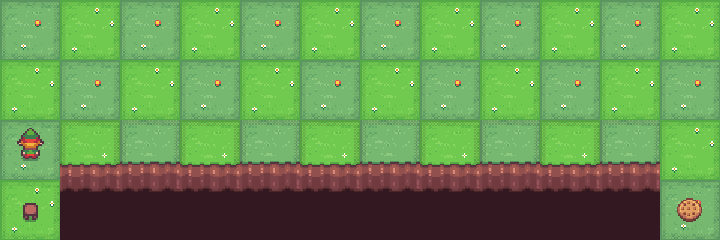
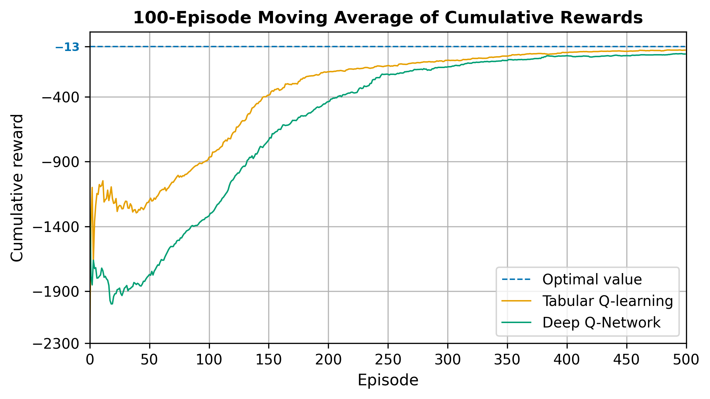
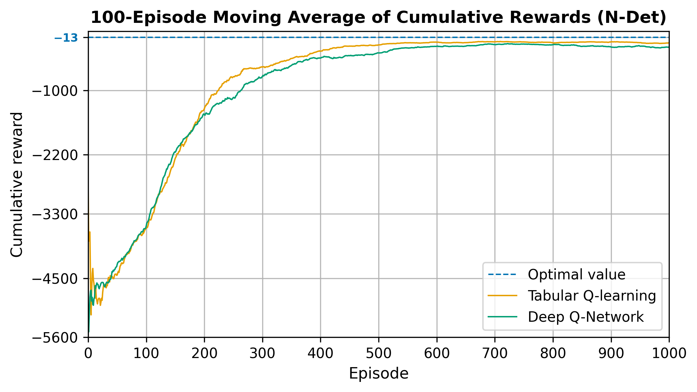
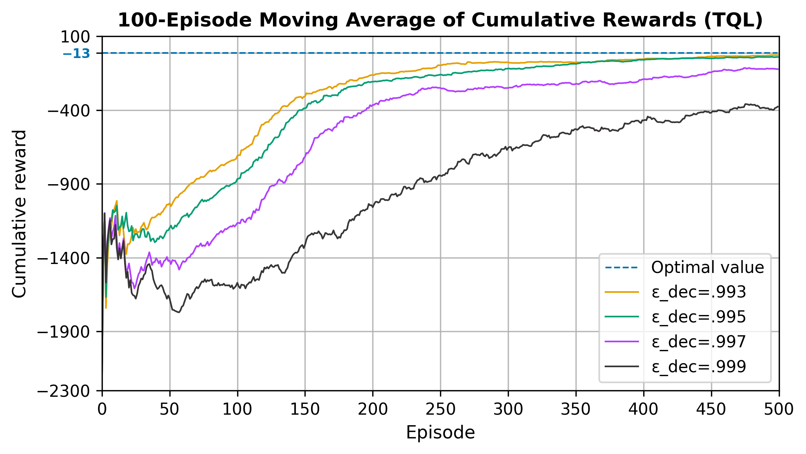
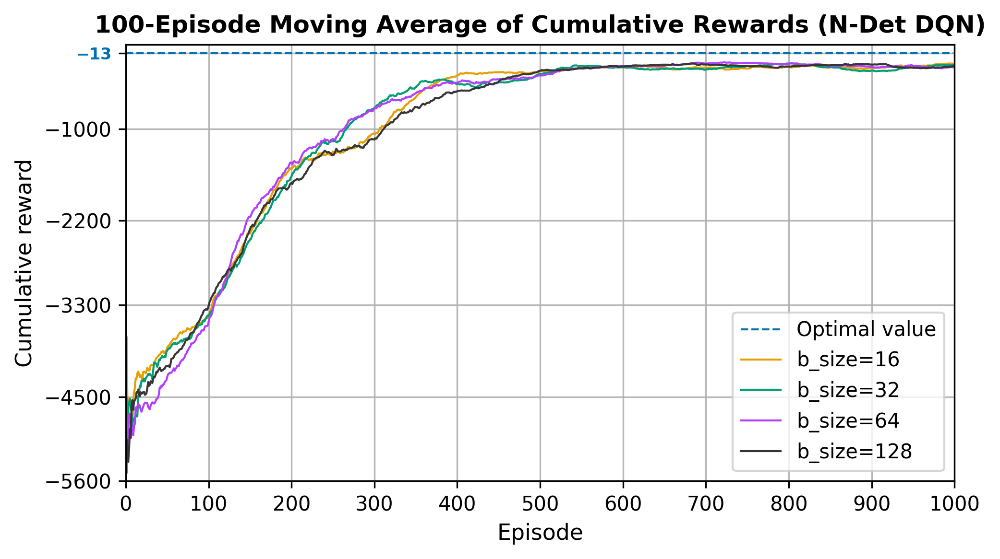

# q-learning-agent
This university project implements and compares `Tabular Q-learning` and `Deep Q-Network` on the deterministic and non-deterministic version of `Cliff Walking` environment from [**Gymnasium**](https://gymnasium.farama.org/environments/toy_text/cliff_walking/).

It mainly helped me to understand the mechanisms of the RL algorithms, but also to examine their sensitivity to hyperparameters and environment dynamics.



## Installation and usage
```bash
$ git clone https://github.com/brynrefill/q-learning-agent.git
$ cd q-learning-agent
$ python3 -m venv .venv
$ source .venv/bin/activate
(.venv) $ pip install gymnasium matplotlib torch pygame
(.venv) $ python3 main.py --env {det | ndet}
```

## Some of the plots





Additional plots, along with the collected data, can be found in the `data/` folder.
